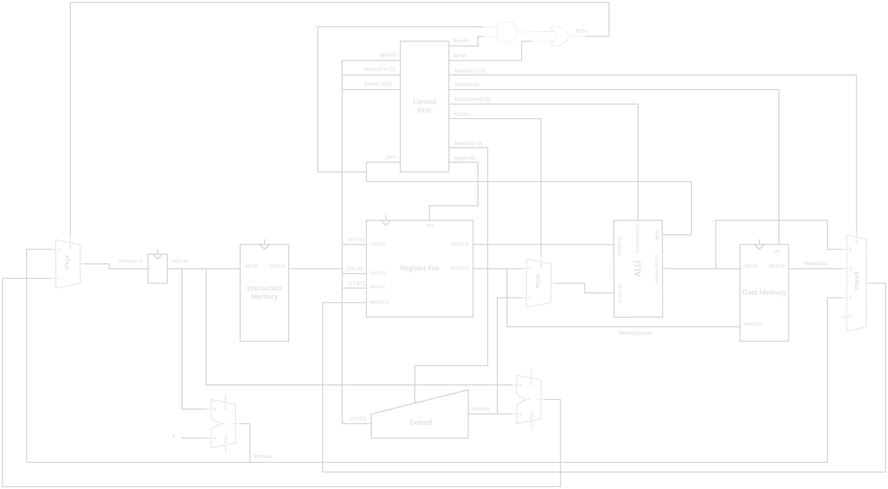

# FPGA project

The goal is to create an educational RISCV core from scratch following the book
*Digital design and computer architecture: RISCV edition* by Sarah L Harris and David Harris on a
Tang 138K console.

## Hardware

My Tang 138K contains :
- GOWIN GW5AST-LV138PG484AC1/I0
- 2x Winbond W9825G6KH-6: small SDR SRAM of 32KB each. Easier access than DDR3.
- 2x SK hynix H5TQ4G63EFR-RDC: larger SRAM of 1GB each, DDR3-1866-class RDC speed grade

## Tooling

### Toolchain

Fully open-source toolchain :
- yosys: parse verilog.
- nextpnr-himbaechel: routing.
- apycula: generate the bitstream.
- openFPGALoader: load the bitstream.
Install the [OSS CAD Suite](https://github.com/YosysHQ/oss-cad-suite-build/releases),
which includes Yosys, nextpnr-himbaechel, Apicula, and openFPGALoader into
`./oss-cad-suite` folder.
Then, each time, to use it, source the environment file :
```
. ./oss-cad-suite/environment
```

Install udev rules once :
```
sudo curl https://raw.githubusercontent.com/trabucayre/openFPGALoader/refs/heads/master/70-openfpgaloader.rules -o /etc/udev/rules.d/70-openfpgaloader.rules
sudo udevadm control --reload-rules
sudo udevadm trigger
```
Then, with "MCU" USB-C connected (not "FPGA"), the board should be detected by openFPGALoader: `openFPGALoader -b tangconsole --detect`.

### LogicLab

To orchestrate synthetization, simulation, and all tooling, this repo provide a 
python-based tool *LogicLab*. Packaged with uv it can be installed easily. 
LogicLab look for a logiclab.yml at the top of a project, it parse it to 
know project simulation target and synthetization target.

LogicLab need the environment variable `OSS_CAD_PATH` to be defined, as it use 
OSS-CAD internaly.

## Projects

As part of the books `project/single_cycle_riscv` implement a single-cycle RV32I RISCV core.
It include testbench simulation and synthezis on Tang 138K board, with a small blinky.hex 
program to assess functionality. Simulation and synthesis are run through **LogicLab** and 
are enabled in CI.



## Course notes

Check `courses` folder for my notes following the book *Digital design and computer architecture:
RISCV edition* by Sarah L Harris and David Harris.
Each chapter should contain markdown notes, and exercices made.
The markdown should build with mdbook in CI and produce a static page / pdf. !TODO!

### Excalidraw setup

Excalidraw is a very good tool to draw quick schematics for logic circuit.

Use this to launch a excalidraw instance :
```
docker run -d \
  --name excalidraw \
  --restart unless-stopped \
  -p 8080:80 \
  excalidraw/excalidraw:latest
```
Then, download the logic gate library at `https://libraries.excalidraw.com/libraries/thebrahmnicboy/Logic-Gates.excalidrawlib`.

Then, load it in excalidraw (`localhost:8080`), don't forget to activate grid 
and select lines with sharp edges. Enjoy!

### WaveDrom

WaveDrom is a simple tool to generate timing diagram from a JSON specification.
Find documentation here : https://github.com/wavedrom/wavedrom

Here's an example of command line use :
```
npx wavedrom --input courses/ch03/register_timing.json > courses/ch03/register_timing.svg
```
Produced SVG can then be processed by excalidraw for annotating.
