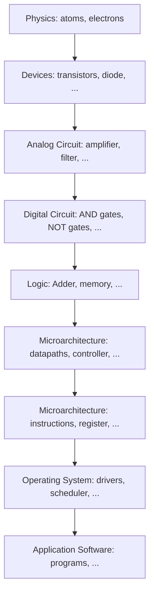

# Chapter 1 : From zero to one.

Microprocessors revolution in the past 3 decades have enabled improvements 
in many fields: automobile, space, cell phone, internet.

## Managing complexity

The key is **abstraction**, build complex block by assembling complexe 
abstracted block, new block become a new abstracted block for a upper layer.

**Digital circuit** is a special case of **analog circuit**.

**Microarchitecture** is the logic-level implementation of an **architecture** 
which is a description of a circuit from the programmer perspective.

It's a bit false to say that OS don't bother about microarchitecture, as well
as saying  that digital circuit don't bother about devices, but the idea is
here : **abstraction**.

**Discipline** is the act of intentionaly restricting design choices to reduce 
complexity.

**Hierarchy** is the act of dividing a module into sub-module up to the point 
where pieces are understandable. It's kind of "building abstraction*.

**Modularity** state that modules have well defined interface so that they can 
connect easily.

**Regularity** seek uniformity across modules, so that modules can be re-used.

A lot of this complexity managements technics are day-to-day jobs of software 
engineer. This must be applied to digital design too.

## Logic gates

One inputs gate are : **NOT** and **buffer**. NOT gate output is the inverse 
of the input. Buffer are, from the logical point of view, not different to a 
wire. But for the lower level of abstraction it may have desirable 
characteristics : large current, ...

2 inputs gates are regular boolean operation : AND, NAND, OR, NOR, XOR, XNOR, 
...

Theses logics gates can exist with more inputs (NOR3, ...).

## Beneath the digital abstraction

Devices must deal with noise and natural imprecision. Each output have a 
error tolerance, and so inputs. There is a forbidden zone between 1 and 0 
where the behavior is unpredictable (from the device point of view).

Gates have non-perfect transfer characteristics. We must choose input ranges, 
output ranges, and forbidden zones, according to the transfert characteristics 
function. 

Exact VDD can vary between logic family, but to communicate with each other 
gates must be of the same logic family. Common logic families are : TTL, CMOS, 
LVTTL, LVCMOS.

## CMOS transistor

MOSFET stand for *Metal-oxide-semiconductor field effect transistor* and CMOS 
for *Complementary MOS(FET)*. The "Complementary" here means that the circuit
is composed of P-MOS and N-MOS which are opposite in behavior, and so, 
complementary.

Silicon is a bad conductor, but it become better when adding some dopant: 
either a ionized atome with negative charge (As+) or a ionized atome with 
positive charge (B-). Here we call Boron (B) a **p-type** dopant, and Arsenic 
(As) a **n-type** dopant.

Because silicon is a bad conductor, but with dopant added it become one, it's
called a **semiconductor**.

Using the dopant technics, it's possible to build diode, capacitance and 
transistors. Creating a transistor involve a gate (conductor) and a substrat 
where some dopant is added. Depending of the type of dopant added (n-type,
or p-type), and of the type of substrate, it become a nMOS or pMOS transistor.
In pMOS, positive carier dominate (so there is more holes than electrons),
in nMOS negative carrier dominate (there is more electrons than holes).

The difference of voltage between Gate and the silicon underneath (the channel) 
create a field effect that let electrons (or holes) flow, decreasing this 
difference of voltage. It explain why pMOS transistor pass 1 well but 0 poorly. 
nMOS transistor pass 0 well but 1 poorly. Luckily, it's possible to create
logic gate that only use transistor to what they're good at: CMOS.

The general form of CMOS based gates are composed of 2 parts : a pull-down
network composed of nMOS transistor, a pull-up network composed of pMOS 
transistor. NMOS sources are tied to GND, while PMOS source are tied to VDD. 

The PMOS pull-up network can be replaced by a single weak PMOS. If the
pull-down network actively pull the signal to low it will bypass the 
weak PMOS. Otherwise the signal is pulled up by the weak PMOS. This allow 
redusing the number of gates at cost of higher consumption, because this 
create a short circuit when signal is driven low ny NMOS network.

Digital systems consume power, we separate dynamic consumption from static 
consumption. Dynamic consumption is the power used to charge capacitances 
et each clock cycle. Fixed consumption is the leakage current when system 
is idle.

## A look ahead

Chap 2 addresses combinational logic, chapter 3 sequential logic. Chapter 4 
dive into HDLs (hardware description language). Then, in chapter 5 we're 
building blocks used in chapter 7 to construct a RISCV processor.
