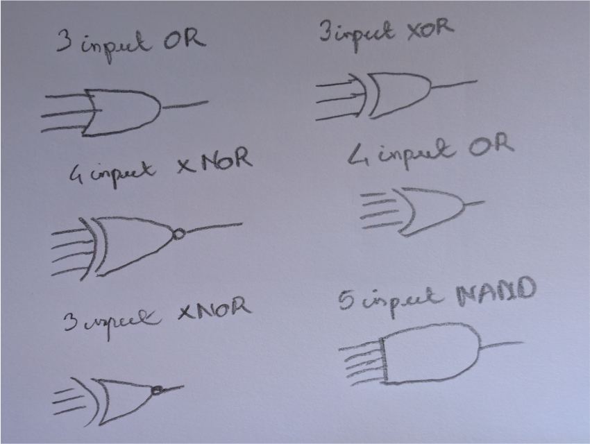

# Chapter 01 exercices

## 1.71

a)
| A | B | C | Y |
|---|---|---|---|
| 0 | 0 | 0 | 0 |
| 0 | 0 | 1 | 1 |
| 0 | 1 | 0 | 1 |
| 0 | 1 | 1 | 1 |
| 1 | 0 | 0 | 1 |
| 1 | 0 | 1 | 1 |
| 1 | 1 | 0 | 1 |
| 1 | 1 | 1 | 1 |

- (min variable mean NOT)
- Y = abC + aBc + aBC + Abc + AbC + ABc + ABC
- (ABc + ABC = AB)
- Y = abC + aBc + aBC + Abc + AbC + AB
- (Abc + AbC = Ab)
- Y = abC + aBc + aBC + Ab + AB
- (aBc + aBC = aB)
- Y = abC + aB + Ab + AB
- (aB + AB = B)
- Y = abC + B + Ab
- (use the boolean identity: B + Ab = A + B)
- Y = abC + A + B
- (since when A and B are 1 the expression is already 0, we can simplify abC into C)
- Y = A + B + C

b)
True when an odd number of input are 1.

| A | B | C | Y |
|---|---|---|---|
| 0 | 0 | 0 | 0 |
| 0 | 0 | 1 | 1 |
| 0 | 1 | 0 | 1 |
| 0 | 1 | 1 | 0 |
| 1 | 0 | 0 | 1 |
| 1 | 0 | 1 | 0 |
| 1 | 1 | 0 | 0 |
| 1 | 1 | 1 | 1 |

- Y = abC + aBc + Abc + ABC
- Y = C(ab + AB) + c(aB + Ab)

c)
False when an odd number of input are 1.

| A | B | C | D | Y |
|---|---|---|---|---|
| 0 | 0 | 0 | 0 | 1 |
| 0 | 0 | 0 | 1 | 0 |
| 0 | 0 | 1 | 0 | 0 |
| 0 | 0 | 1 | 1 | 1 |
| 0 | 1 | 0 | 0 | 0 |
| 0 | 1 | 0 | 1 | 1 |
| 0 | 1 | 1 | 0 | 1 |
| 0 | 1 | 1 | 1 | 0 |
| 1 | 0 | 0 | 0 | 1 |
| 1 | 0 | 0 | 1 | 1 |
| 1 | 0 | 1 | 0 | 1 |
| 1 | 0 | 1 | 1 | 0 |
| 1 | 1 | 0 | 0 | 1 |
| 1 | 1 | 0 | 1 | 0 |
| 1 | 1 | 1 | 0 | 0 |
| 1 | 1 | 1 | 1 | 1 |

## 1.72
a)
| A | B | C | D | Y |
|---|---|---|---|---|
| 0 | 0 | 0 | 0 | 0 |
| 0 | 0 | 0 | 1 | 1 |
| 0 | 0 | 1 | 0 | 1 |
| 0 | 0 | 1 | 1 | 1 |
| 0 | 1 | 0 | 0 | 1 |
| 0 | 1 | 0 | 1 | 1 |
| 0 | 1 | 1 | 0 | 1 |
| 0 | 1 | 1 | 1 | 1 |
| 1 | 0 | 0 | 0 | 1 |
| 1 | 0 | 0 | 1 | 1 |
| 1 | 0 | 1 | 0 | 1 |
| 1 | 0 | 1 | 1 | 1 |
| 1 | 1 | 0 | 0 | 1 |
| 1 | 1 | 0 | 1 | 1 |
| 1 | 1 | 1 | 0 | 1 |
| 1 | 1 | 1 | 1 | 1 |

- Y = A + B + C + D

b)
| A | B | C | Y |
|---|---|---|---|
| 0 | 0 | 0 | 1 |
| 0 | 0 | 1 | 0 |
| 0 | 1 | 0 | 0 |
| 0 | 1 | 1 | 1 |
| 1 | 0 | 0 | 0 |
| 1 | 0 | 1 | 1 |
| 1 | 1 | 0 | 1 |
| 1 | 1 | 1 | 0 |

- Y = abc + aBC + AbC + ABc

c)
| A | B | C | D | E | Y |
|---|---|---|---|---|---|
| 0 | 0 | 0 | 0 | 0 | 1 |
| 0 | 0 | 0 | 0 | 1 | 1 |
| 0 | 0 | 0 | 1 | 0 | 1 |
| 0 | 0 | 0 | 1 | 1 | 1 |
| 0 | 0 | 1 | 0 | 0 | 1 |
| 0 | 0 | 1 | 0 | 1 | 1 |
| 0 | 0 | 1 | 1 | 0 | 1 |
| 0 | 0 | 1 | 1 | 1 | 1 |
| 0 | 1 | 0 | 0 | 0 | 1 |
| 0 | 1 | 0 | 0 | 1 | 1 |
| 0 | 1 | 0 | 1 | 0 | 1 |
| 0 | 1 | 0 | 1 | 1 | 1 |
| 0 | 1 | 1 | 0 | 0 | 1 |
| 0 | 1 | 1 | 0 | 1 | 1 |
| 0 | 1 | 1 | 1 | 0 | 1 |
| 0 | 1 | 1 | 1 | 1 | 1 |
| 1 | 0 | 0 | 0 | 0 | 1 |
| 1 | 0 | 0 | 0 | 1 | 1 |
| 1 | 0 | 0 | 1 | 0 | 1 |
| 1 | 0 | 0 | 1 | 1 | 1 |
| 1 | 0 | 1 | 0 | 0 | 1 |
| 1 | 0 | 1 | 0 | 1 | 1 |
| 1 | 0 | 1 | 1 | 0 | 1 |
| 1 | 0 | 1 | 1 | 1 | 1 |
| 1 | 1 | 0 | 0 | 0 | 1 |
| 1 | 1 | 0 | 0 | 1 | 1 |
| 1 | 1 | 0 | 1 | 0 | 1 |
| 1 | 1 | 0 | 1 | 1 | 1 |
| 1 | 1 | 1 | 0 | 0 | 1 |
| 1 | 1 | 1 | 0 | 1 | 1 |
| 1 | 1 | 1 | 1 | 0 | 1 |
| 1 | 1 | 1 | 1 | 1 | 0 |

- Y = a + b + c + d + e

## 1.73

| A | B | C | Y |
|---|---|---|---|
| 0 | 0 | 0 | 0 |
| 0 | 0 | 1 | 0 |
| 0 | 1 | 0 | 0 |
| 0 | 1 | 1 | 1 |
| 1 | 0 | 0 | 0 |
| 1 | 0 | 1 | 1 |
| 1 | 1 | 0 | 1 |
| 1 | 1 | 1 | 1 |

- Y = aBC + AbC + ABc + ABC
- Y = aBC + AbC + ABc + ABC + ABC + ABC
- Y = BC(a + A) AC(b + B) + AB(c + C)
- Y = AB + AC + BC

## 1.74

| A | B | C | Y |
|---|---|---|---|
| 0 | 0 | 0 | 0 |
| 0 | 0 | 1 | 1 |
| 0 | 1 | 0 | 0 |
| 0 | 1 | 1 | 1 |
| 1 | 0 | 0 | 0 |
| 1 | 0 | 1 | 1 |
| 1 | 1 | 0 | 1 |
| 1 | 1 | 1 | 1 |

## 1.75

| A | B | C | Y |
|---|---|---|---|
| 0 | 0 | 0 | 1 |
| 0 | 0 | 1 | 1 |
| 0 | 1 | 0 | 1 |
| 0 | 1 | 1 | 1 |
| 1 | 0 | 0 | 1 |
| 1 | 0 | 1 | 1 |
| 1 | 1 | 0 | 1 |
| 1 | 1 | 1 | 0 |

## 1.76

1: GND?
| A | B | Y | 
|---|---|---| 
| 0 | 0 | 0 | 
| 0 | 1 | 0 | 
| 1 | 0 | 0 | 
| 1 | 1 | 0 | 

2: NOR gate
| A | B | Y | 
|---|---|---| 
| 0 | 0 | 1 | 
| 0 | 1 | 0 | 
| 1 | 0 | 0 | 
| 1 | 1 | 0 | 

3: not(A) AND B
| A | B | Y | 
|---|---|---| 
| 0 | 0 | 0 | 
| 0 | 1 | 1 | 
| 1 | 0 | 0 | 
| 1 | 1 | 0 | 

4: not(A)
| A | B | Y | 
|---|---|---| 
| 0 | 0 | 1 | 
| 0 | 1 | 1 | 
| 1 | 0 | 0 | 
| 1 | 1 | 0 | 

5: not(B) AND A
| A | B | Y | 
|---|---|---| 
| 0 | 0 | 0 | 
| 0 | 1 | 0 | 
| 1 | 0 | 1 | 
| 1 | 1 | 0 | 

6: not(B)
| A | B | Y | 
|---|---|---| 
| 0 | 0 | 1 | 
| 0 | 1 | 0 | 
| 1 | 0 | 1 | 
| 1 | 1 | 0 | 

7: XOR
| A | B | Y | 
|---|---|---| 
| 0 | 0 | 0 | 
| 0 | 1 | 1 | 
| 1 | 0 | 1 | 
| 1 | 1 | 0 | 

8: (A XOR B) OR (not(A) AND not(B))
| A | B | Y | 
|---|---|---| 
| 0 | 0 | 1 | 
| 0 | 1 | 1 | 
| 1 | 0 | 1 | 
| 1 | 1 | 0 | 

9: AND
| A | B | Y | 
|---|---|---| 
| 0 | 0 | 0 | 
| 0 | 1 | 0 | 
| 1 | 0 | 0 | 
| 1 | 1 | 1 | 

10: (A AND B) or (not(A) and not(B))
| A | B | Y | 
|---|---|---| 
| 0 | 0 | 1 | 
| 0 | 1 | 0 | 
| 1 | 0 | 0 | 
| 1 | 1 | 1 | 

11: B
| A | B | Y | 
|---|---|---| 
| 0 | 0 | 0 | 
| 0 | 1 | 1 | 
| 1 | 0 | 0 | 
| 1 | 1 | 1 | 

12: B or (not(A) and not(B))
| A | B | Y | 
|---|---|---| 
| 0 | 0 | 1 | 
| 0 | 1 | 1 | 
| 1 | 0 | 0 | 
| 1 | 1 | 1 | 

13: A
| A | B | Y | 
|---|---|---| 
| 0 | 0 | 0 | 
| 0 | 1 | 0 | 
| 1 | 0 | 1 | 
| 1 | 1 | 1 | 

14: A or (not(A) and not(B))
| A | B | Y | 
|---|---|---| 
| 0 | 0 | 1 | 
| 0 | 1 | 0 | 
| 1 | 0 | 1 | 
| 1 | 1 | 1 | 

15: NAND
| A | B | Y | 
|---|---|---| 
| 0 | 0 | 0 | 
| 0 | 1 | 1 | 
| 1 | 0 | 1 | 
| 1 | 1 | 1 | 

16: VDD
| A | B | Y | 
|---|---|---| 
| 0 | 0 | 1 | 
| 0 | 1 | 1 | 
| 1 | 0 | 1 | 
| 1 | 1 | 1 | 

## 1.77

A boolean function of N variable have 2^N possibilities. There 2 power this 
number of possiblities truth table.
So, there is 2 ^ (2 ^ N) truth table for a boolean function of N variable.

## 1.78

Yes its possible.
Vil = 2.5
Vol = 1.5
Vih = 4.5
Voh = 4

## 1.79

Maybe it's not possible because slope never goes under -1?
Vil = 1.5
Vol = 1
Vih = 3.5
Voh = 3.5

Note that Vih is too close to Voh, this will cause trouble.

NOTE CORRECTION: the slope never goes to -1 so it's not possible.

## 1.80

No because of the glitch that occure at Vin 3-4.
The function act as a buffer but that could be OK.

## 1.81

This transfert function is suitable for a buffer, because Vin and Vout are not inversed.
It is in the correct voltage range for LVCMOS and LVTTL logic family.
But the transfert characteristic does not correspond: Vil, Vol and Voh are too high .

## 1.82

He found a weird AND gate that correspond to no logic gate family.
Vih is at 2V while VDD is at 3.3.

## 1.86

This is probably a LVCMOS OR gate.

## 1.87

| A | B | Y | 
|---|---|---| 
| 0 | 0 | 0 | 
| 0 | 1 | 1 | 
| 1 | 0 | 1 | 
| 1 | 1 | 0 | 

It's a XOR gate.

## 1.88

| A | B | C | Y |
|---|---|---|---|
| 0 | 0 | 0 | 1 |
| 0 | 0 | 1 | 0 |
| 0 | 1 | 0 | 1 |
| 0 | 1 | 1 | 0 |
| 1 | 0 | 0 | 1 |
| 1 | 0 | 1 | 1 |
| 1 | 1 | 0 | 0 |
| 1 | 1 | 1 | 0 |

Y = c(a or b)

