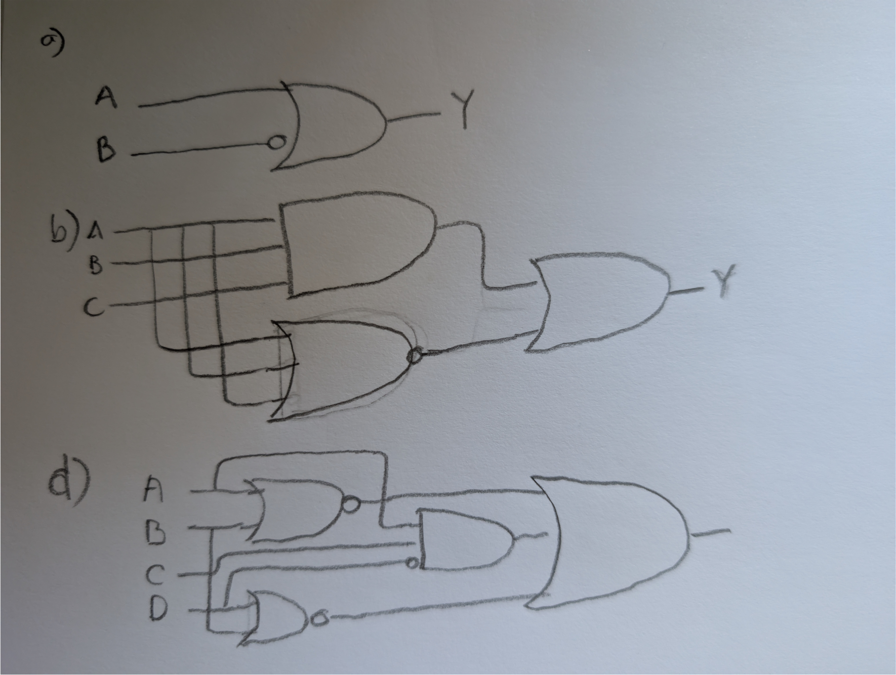
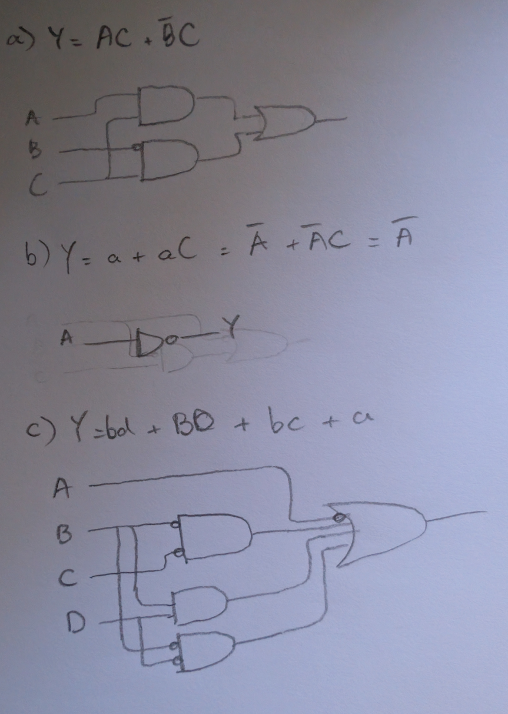
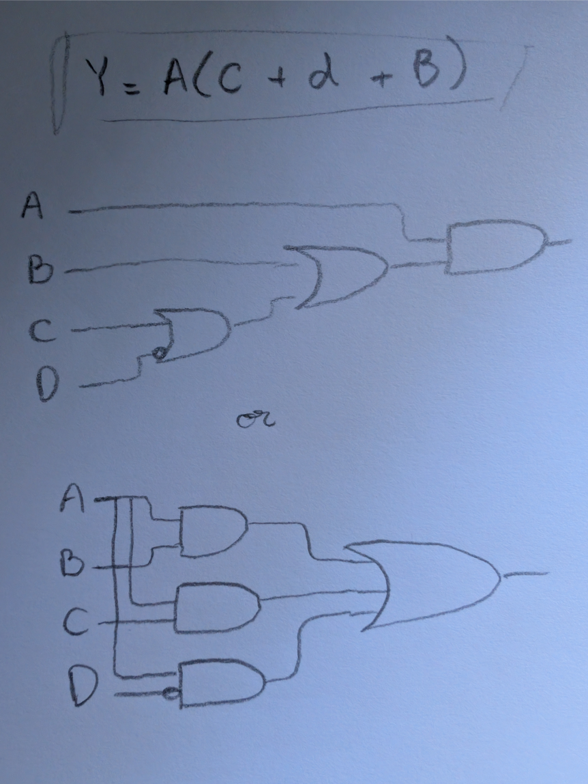
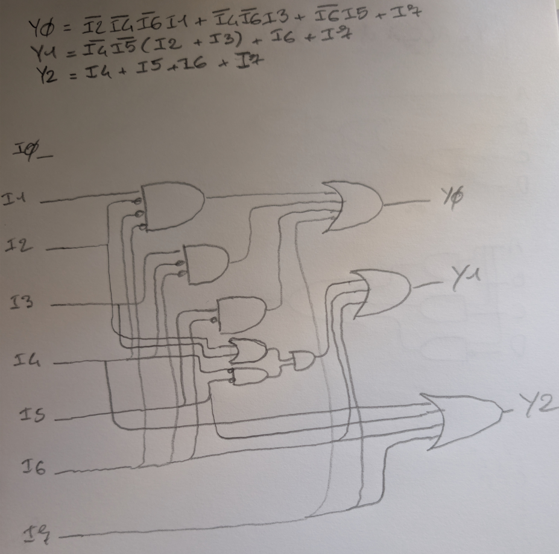

# Chapter 02 : exercices

## 2.1

a)
- Y = ab + aB + AB
- Y = a(b + B) + AB
- Y = a + AB

b)
- Y = abc + ABC

c)
- Y = abc + aBc + Abc + AbC + ABC

d)
- Y = abcd + abcD + abCd + abCD + Abcd + AbCd + ABCd
- Y = abc + abC + Abd + ABCd
- Y = ab + Abd + ABCd

e)
- Y = abcd + abCD + aBcD + aBCd + AbcD + AbCd + ABcd + ABCD
- Y = ab(cd + CD) + BD(ac + AC) + aBCd + AbcD + AbCd + ABcd
- Y = ab + BD + aBCd + AbcD + AbCd + ABcd

## 2.3

a)
- Y = (a + B)

b)
- Y = (a + b + C)(a + B + c)(a + B + C)(A + b + c)(A + b + C)(A + B + c)

c)
- Y = (a + b + C)(a + B + C)(A + B + c)

d)
- Y = (a + B + c + d)(a + B + c + D)(a + B + C + d)(a + B + C + D)(A + b + c + D)(A + b + C + D)(A + B + c + d)(A + B + c + D)(A + B + C + d)

e)
- Y = (a + b + c + D)(a + b + C + d)(a + B + c + d)(a + B + C + D)(A + b + c + d)(A + b + C + D)(A + B + c + D)(A + B + C + d)

## 2.5

a)
- Y = ab + Ab + AB
- Y = ab + A
- Y = b + A

b)
- Y = abc + ABC

c)
- Y = abc + aBc + Abc + AbC + ABC
- Y = ac + Ab + ABC
- Y = ac + A(b + BC) -> factor A
- Y = ac + A(b + C) -> use identity
- Y = ac + Ab + AC -> distribute

d)
- Y = abcd + abcD + abCd + abCD + Abcd + AbCd + ABCd
- Y = abc + abC + Abd + ABCd
- Y = ab + Abd + ABCd
- Y = b(a + Ad) + ABCd
- Y = b(a + d) + ABCd
- Y = ba + bd + ABCd
- Y = ba + d(b + ABC)
- Y = ba + d(b + AC)
- Y = ba + bd + ACd

e)
- Y = abcd + abCD + aBcD + aBCd + AbcD + AbCd + ABcd + ABCD

## 2.7

## 2.9

With bubble pushing I can replace the NOR gate by NOT and AND gates.

## 2.13

a)
- Y = AC + abC
- Y = C(A + ab)
- Y = C(A + b)
- Y = AC + bC

b)
- Y = ab + aBc + nor(A, c)
- Y = ab + aBc + aC
- Y = ab + a(Bc + C)
- Y = ab + a(B + C)
- Y = ab + aB + aC
- Y = a(b + B) + aC
- Y = a + aC

c)
- Y = abcd + Abc + AbCd + ABD + abCd + BcD + a
- Y = abcd + Abc + bCd(a + A) + ABD + BcD + a
- Y = abcd + Abc + bCd + ABD + BcD + a
- Y = bc(ad + A) + bCd + ABD + BcD + a
- Y = bc(d + A) + bCd + ABD + BcD + a
- Y = bcd + bcA + bCd + ABD + BcD + a
- Y = bd(c + C) + bcA + ABD + BcD + a
- Y = bd + bcA + ABD + BcD + a
- Y = bd + bc + BD + BcD + a
- Y = bd + c(b + BD) + BD + a
- Y = bd + c(b + D) + BD + a
- Y = bd + bc + cD + BD + a -> use *consensus*: cD is already covered by `BD +
bc`
- Y = bd + BD + bc + a

## 2.15

## 2.17

a)
- Y = BC + abc + Bc
- Y = B + abc
- Y = B + ac

b)
- Y = nor(A, aB, ab) + nor(A, b)
- Y = a(nand(a, B))(nand(a, b)) + aB
- Y = a(A + b)(A + B) + aB -> use `T8(bis)`
- Y = a(A + (bB)) + aB
- Y = a(A + 0) + aB
- Y = a(A) + aB
- Y = 0 + aB
- Y = aB

## 2.22

Indempotency theoreme state that `BB == B`
- B = B * 1
- 1 = B + b
- B = B(B + b)
- B = BB + bB -> use *complements*.
- B = BB

Distributivity theorem state that `(B and C) or (B and D) == B and (C or D)`.
Distributivity is one of the fundational axiom/law and cannot be proved using 
boolean algebra only. It can be observed on truth table.

The combining theorem state that `(B and C) or (B and not(C)) == B`.
- BC + Bc = B
- B(C + c) = B
- B(1) = B

## 2.23

De Morgan's theorem state that `nand(A, B, ...) == not(A) or not(B) or ...`. If 
we observe the property of `nand(A, B, C)` we can see it's 0 only when all 
elements are 1, we can inverse this sentence by saying "it's 1 when at least
one element is 0". Translating this last sentence in boolean algebra it become
`not(A) or not(B) or not(C)`.

## 2.28

- Y = Abcd + AbCD + ABcd + ABcD + ABCD
- Y = Abcd + AbCD + ABc + ABCD
- Y = Abcd + AbCD + AB(c + CD)
- Y = Abcd + AbCD + AB(c + D)
- Y = Abcd + AbCD + AbCd + ABc + ABD <- introduce a don't care entry
- Y = Abcd + AbC + ABc + ABD
- Y = Abcd + AbCd + AbC + ABc + ABD
- Y = Abd + AbC + ABc + ABD
- Y = A(bd + bC + Bc + BD)

This can be better, let's re-start with some don;t care in the equations.
- Y = Abcd + AbCD + ABcd + ABcD + ABCD + ABCd + AbCd
- Y = A(bcd + bCD + Bcd + BcD + BCD + BCd + bCd)
- Y = A(cd + CD + BcD + Cd)
- Y = A(cd + C + BcD)
- Y = A(c(d + BD) + C)
- Y = A(c(d + B) + C) -> apply *identity* on Cs.
- Y = A(C + d + B)

## 2.29

## 2.30

First version contains glitch. Because A can activate the signal, that would be
take down by BCD later. The second version contains no glitch but have more 
gates.

## 2.36

Design a priority encoder with 8 inputs and 3 bits output. 
Example: if input is 00100000, output should be 101.

Need to select the input to display, according to MSB priority 
(lowercase i5 mean complement of input no 5):
- S7 = I7
- S6 = i7I6
- S5 = i6i7I5
- S4 = i5i6i7I4
- S3 = i4i5i6i7I3
- S2 = i3i4i5i6i7I2
- S1 = i2i3i4i5i6i7I1
- S0 = i1i2i3i4i5i6i7I0

Now let see the output depending on the selected input (note that 
output is inverted: LSB):
| S | Y2 | Y1 | Y0 |
|---|----|----|----|
| 0 | 0  | 0  | 0  |
| 1 | 0  | 0  | 1  |
| 2 | 0  | 1  | 0  |
| 3 | 0  | 1  | 1  |
| 4 | 1  | 0  | 0  |
| 5 | 1  | 0  | 1  |
| 6 | 1  | 1  | 0  |
| 7 | 1  | 1  | 1  |

So, this give us :
- Y0 = S1 + S3 + S5 + S7
- Y1 = S2 + S3 + S6 + S7
- Y2 = S4 + S5 + S6 + S7

Simplified, this become :
- Y0 = (i2i3i4i5i6i7I1) + (i4i5i6i7I3) + (i6i7I5) + I7
- Y0 = i2i4i6I1 + i4i6I3 + i6I5 + I7
- Y1 = i3i4i5i6i7I2 + i4i5i6i7I3 + i7I6 + I7
- Y1 = i4i5I2 + i4i5I3 + I6 + I7
- Y1 = i4i5(I2 + I3) + I6 + I7
- Y2 = i5i6i7I4 + i6i7I5 + i7I6 + I7
- Y2 = I4 + I5 + I6 + I7

## 2.41
## 2.43
## 2.48
