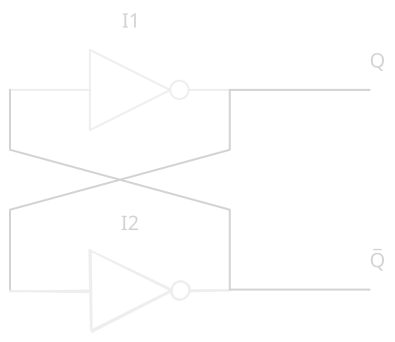
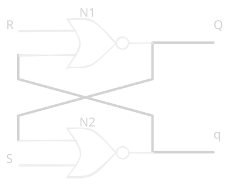
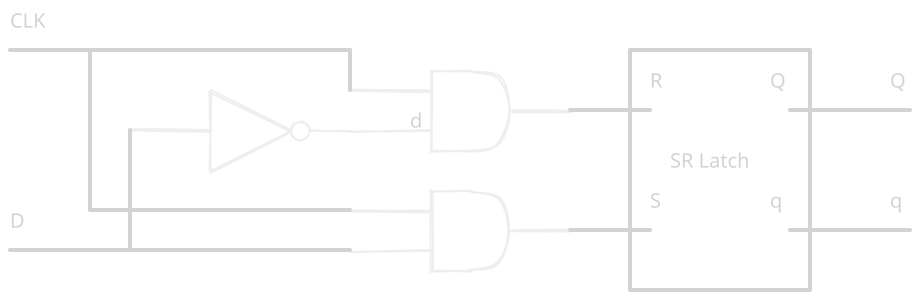
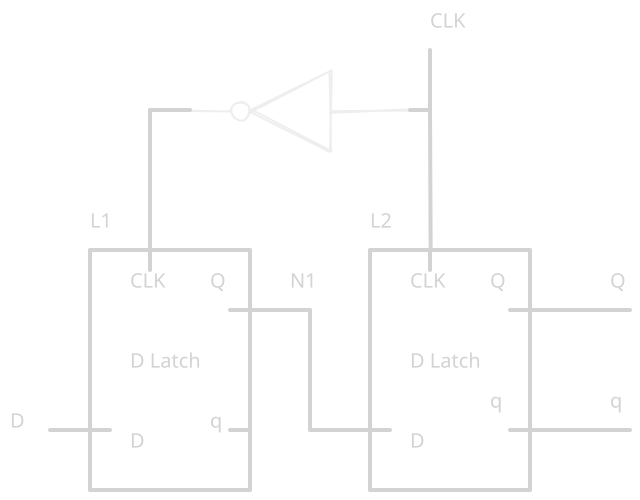
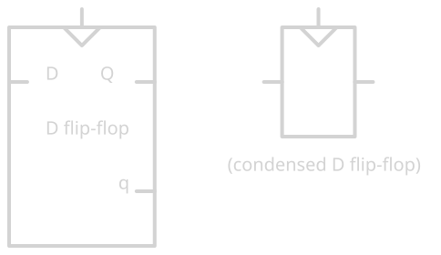
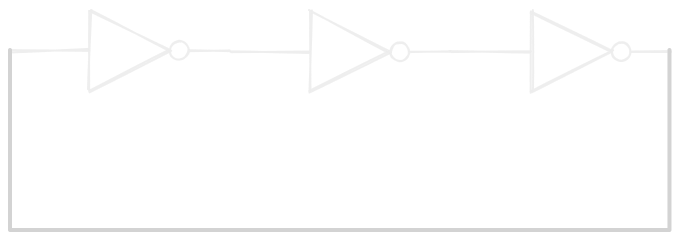
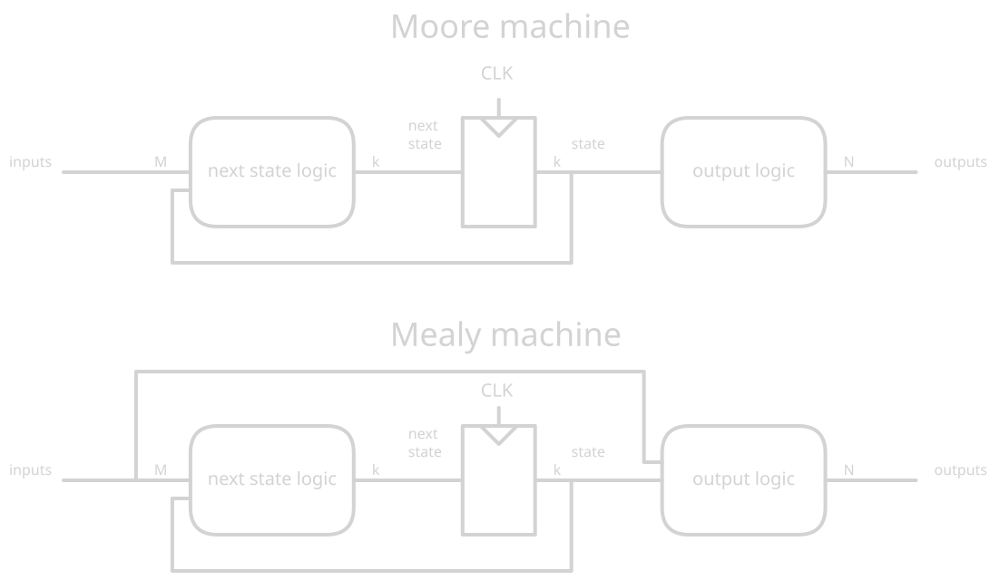
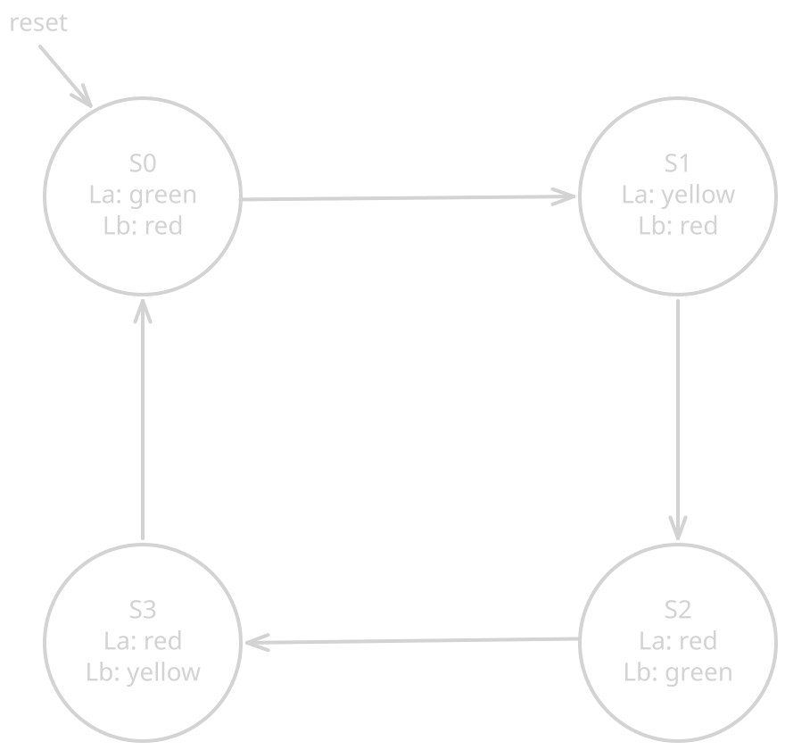
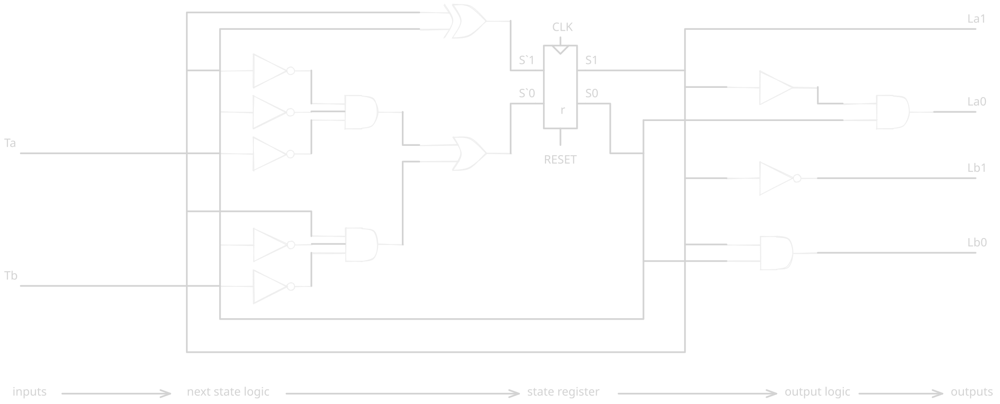
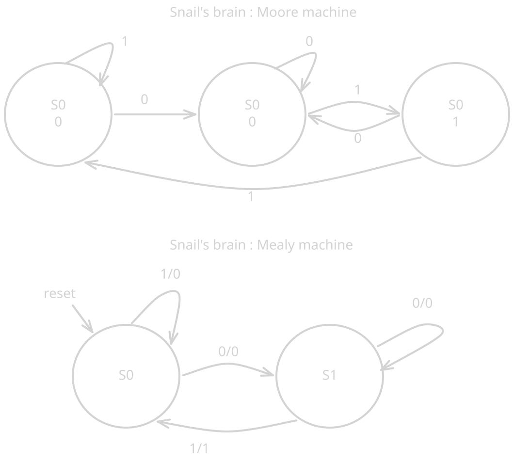

# Chapter 03: Sequential logic design

The last chapter focused on *combinational logic* design: given a specification 
in the form of a truth table or a boolean equation we can create a circuit to
meet the specifications. 

This chapter focus on *sequential logic*. The ouput depends not only of the 
inputs but also of the previous inputs values. Sequential logic have *memory*. 
The state of a sequential circuit is a set of bits called *state variabble*.

Sequencial circuit can be very complexe. We discipline ourselves by studying 
only **synchronous sequential circuits consisting of combinational logic and 
banks of flip-flop.**. We'll introduce finite-state-machine (FSM), analyze 
the speed of sequential circuits, and discuss parallelism.

## Bistable

The fundamental building block of a sequential circuit is called a *bistable* 
element. It have 2 stable state.

The very simple bistable circuit consist of a pair of inverter connected in a 
loop: L1 and L2. The circuit have no input but it have 2 output: Q and q. 
Because of the cyclic property of the circuit, to analyze it we need to make 
hypothesis :
- Q is true: then L2 receive 1, and output 0 (q is false). L1 receive 0 and 
output 1 (Q is true).
- Q is false: then L2 receive 0, and output 1 (q is true). L1 receive 1 and 
output 0 (Q is false).

When power is first applied to a sequential circuit the initial state is 
unknow and usualy unpredictable. The previous circuit is unusable because 
while it can store a bit of information, there is no input to control the 
state. More evolved bistable elements such as *latches* and *flip-flops* 
provide inputs to control the state.

## SR Latch

One of the simplest sequential circuit. It's similar to the previous bistable 
circuit, but it's state can be controled via 2 inputs : `S` and `R`, which can 
*set* and *reset* the output `Q`.

Check out this truth table :

| S | R | Q     | q     |
|---|---|-------|-------|
| 0 | 0 | Qprev | qprev |
| 0 | 1 | 0     | 1     |
| 1 | 0 | 1     | 0     |
| 1 | 1 | 0     | 0     |

With `S=0` and `R=0` one can read the previous value of Q. By setting S or R 
one can set the SR latch state. This is an usable memory circuit !

However the SR latch have some flaws :
- The 4th case (`S=1 R=1`) is awkward.
- The S and R inputs conflate **what** and **when**. Sequential circuit become 
easier when the question of what and when can be separated. 

## D latch

The D latch permit the separation of **what** and **when**. It have 2 inputs: 
`D` and `CLK`. The *data* `D` control the next state, the clock `CLK` control 
when the state should change.

Checkout this truth table, it includ intermediate results.

| CLK | D | S | R | Q     | q     |
|-----|---|---|---|-------|-------|
| 0   | X | 0 | 0 | Qprev | qprev |
| 1   | 0 | 0 | 1 | 0     | 1     |
| 1   | 1 | 1 | 0 | 1     | 0     |

When CLK=1 the latch is said to be *transparent*, the data D flow through Q as 
if the latch were just a buffer. When CLK=0 the latch is *opaque*, it block the 
new data and retains the old value of Q.

The D-latch update it's state continuously while CLK=1. It's usefull to update 
the state only at a specific instant in time, that's what does the D flip-flop.

## D flip-flop

Now we come to the real building block of memory: **data flip-flop**. It's 
based on all the block above.

The first latch L1 is called the *leader*, L2 is called the *follower*. 
When CLK=0 the leader L1 is transparent and L2 is opaque. So D is stored into 
L1 and propagate to N1, but the output Q is what's stored in L2. 
When CLK=1 the first latch L1 become opaque, so N1 become the value stored in 
it. The second latch is now transparent and it output and save the N1 value.

In other words *a D flip-flop copies D to Q on the rising edges of the clock 
and remember its state at all other time*.

When q output is not needed the symbol is often condensed with 1 output. 

A variant called *enabled flip-flop* exist, with an additional input EN to 
determine wether D should be loaded on the clock edge. An enabled flip-flop 
with EN enabled act like a normal flip-flop. When EN is false, the enabled 
flip-flop retains its state and ignore the clock. One can build an enabled flip 
flop from an ordinary flip-flop by AND-ing CLK and EN.

Another variant called *(re)settable flip-flop* exist, with an additional input 
(RE)SET. When RESET is false it behave like an ordinary flip-flop. When reset 
is true, it ignore D and set the output to 0. One can build a **synchronous**
resettable flip-flop by AND-ing RESET and D. **Asynchronous** flip-flop 
reset themselves regardless of the CLK. 

A N-bit **register** is a bank of N flip-flops that share a common CLK input, 
so that all bit of the register are updated at the same time.

At transistor level a D-latch cost about 12 transistors, and a D flip-flop only 
20.

*A D-latch is level-sensitive, whereas a D flip-flop is edge triggered. The 
D-latch is transparent when CLK=1, allowing D to flow through Q. The D
flip-flop copies D to Q on the rising edge of CLK. At all other times, latches 
and flip-flop retains their old states. A register is a bank of several 
flip-flops sharing a common CLK signal.*

## Putting things together: sequential circuits composition

Following schematics illustrate the ring oscillator case. 3 inverter in a loop
form a "unstable" circuit. The period of the oscillation depends on propagation 
delay of the gates.

Sequential circuit are subject to *race-condition*. It's difficult to control 
the propagation delay of every path, because theses delay can change depending 
on the device, temperatures, etc. Theses kind of race conditions are notably 
difficult to debug.

To avoid this kind of issues, we disciplines ourselves to build combinational 
circuits including small (controllable) sequential parts : **registers**. 
Register contains the *state* of the system, which change at each clock edges, 
the system is *synchronized* to the clock.
As long as combinational operation longest propagation delay is contained in a 
clock cycle, so that every register inputs settle before the next clock edges, 
we can build a formal definition of a sequential circuit.

The rules of **synchronous sequential circuit composition** are as follow:
- Every circuit element is either a register or a combinational circuit.
- At least one circuit element is a register.
- All registers receive the same clock signal.
- Every cyclic path contains at least one register.
- A D flip-flop is the simplest register (of 1 bit).

We refer to the current state as `S` and to the next state as `S'`.

Asynchronous circuit are more general than synchronous circuit, just as analog 
circuits are more general than digital circuits. Synchronous circuit are 
notably easier to design, and that's why. depite of decades of research, 
digital systems are essentially synchronous.

## Finite state machines

Provide a systematic way to design synchronous sequential circuit given a 
functional specification. FSM can be separated into 2 family :
- Moore machine: output logic depends only on the state.
- Mealy machine: output logic depends on the state and on the current intput.

### A real FSM example

We need to create a circuit to control traffic light on a crossway. Lights can 
be `green`, `yellow` and `red`. The overall functionment of the crossway is as 
follow, where :
- `La` is light A and `Lb` is light B.
- `Ta` represent trafic on avenue A (true if there is trafic, false otherwise).

For being able to create a circuit that fulfill this state diagram requirements 
some encoding must be choose. We choose arbitrary encoding for states:
| states | encoding |
|--------|----------|
|   S0   |    00    |
|   S1   |    01    |
|   S2   |    10    |
|   S3   |    11    |

And other for lights :
| light | encoding |
|-------|----------|
| green |    00    |
| yellw |    01    |
|  red  |    10    |

Now we can specify *state transitions* with a truth table:
| S1 | S2 | Ta | Tb | S'1 | S'2 |
|----|----|----|----|-----|-----|
|  0 |  0 |  0 |  X |  0  |  1  |
|  0 |  0 |  1 |  X |  0  |  0  |
|  0 |  1 |  X |  X |  1  |  0  |
|  1 |  0 |  X |  0 |  1  |  1  |
|  1 |  0 |  X |  1 |  1  |  0  |
|  1 |  1 |  X |  X |  0  |  0  |

- S'1 = s1S0 + S1s0tb + S1s0Tb
- S'1 = S1 xor S0
- S'0 = s1s0ta + S1s0tb

Also, we need to write an output table to determine how the output is created 
fron the state (the state only! we can see this in the fsm diagram, light only 
depends on the current state).
| S1 | S2 | La0 | La1 | Lb0 | Lb1 |
|----|----|-----|-----|-----|-----|
|  0 |  0 |  0  |  0  |  1  |  0  |
|  0 |  1 |  0  |  1  |  1  |  0  |
|  1 |  0 |  1  |  0  |  0  |  0  |
|  1 |  1 |  1  |  0  |  0  |  1  |

The boolean equation for outputs are:
- La0 = S0s1
- La1 = S1
- Lb0 = S1S0
- Lb1 = s1

With all this in mind we can create a schematics for this **Moore machine**, 
following Moore machine representations.

It worth noting that we choosed an arbitrary encoding for state and light, such 
encoding must be chosen carefully, as it may reduce or increase circuit 
complexity. Unfortunatly there is no simple way to determine the best encoding. 
Sometimes **one-hot encoding** (1 bit for 1 state) lead to simpler circuit, 
but with more register (for state). The choice of the encoding depends on the 
specific FSM.

## Moore vs Mealy machine

Let's say we have a robotic snail with an FSM brain. It crawl on along a tape 
and read bits, when it read a `0` followed by a `1` it smile, otherwise it 
don't smile.

This problem can be solve by a Moore machine or a Mealy machine. Mealy machine 
depends not only on the state but also on the input. So in their states diagram 
we express the output in the state transition (instead of in the state, like in 
Moore machine). Example : `1/0` : input=1 , output=0. 
Here's the 2 flavors (Moore and Mealy) states diagrams for this problem:

This different states machine leads to differents implementations with 
different timing specifications. Here, the Mealy machine would rise a clock 
sooner, because it respond to the input instead of waiting for the state 
change. When choosing FSM design style, consider **when** you want the outputs 
to respond.

## Factoring FSM

Designing complexe FSM is often easier when it can be broken down into multiple 
interacting simpler state machine. The output of some machines is used as 
inputs in others.

## FSM design

- Identify inputs and outputs.
- Sketch a state transition diagram.
- For a Moore machine : write a state transition table + write an outputs 
table.
- For a Mealy machine : write a combined state transition table and outputs 
table.
- Select state encoding, your selection affects the hw design.
- Write booleans equations for next state and outputs logic.
- Sketch the circuit schematics.

One can find out a FSM state diagram from a schematics following the same 
process in reverse. This can be usefull for reverse engineering, or working 
on existing project with incomplete documentations.

