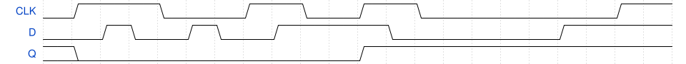
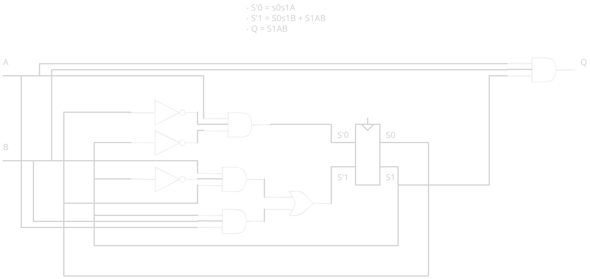
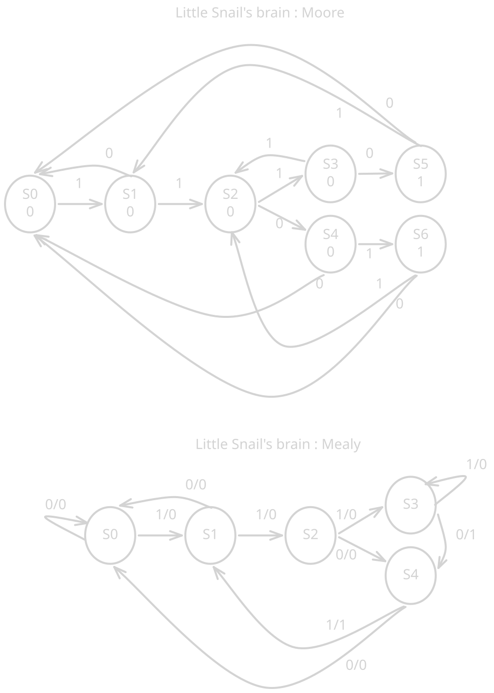
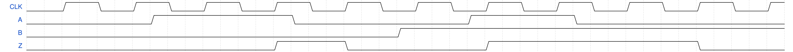

# Chapter 03 : exercices

## 3.1

## 3.3

## 3.5

## 3.7

It's a SR latch with inverted inputs.

## 3.23

Let's state the following encoding :
| states | encoding |
|--------|----------|
|  st0   |    00    |
|  st1   |    01    |
|  st2   |    10    |

**WARNING: S0 and S1 represent bit 0 and 1 of the state encoding where bit 0 is
the least significant bit.**.
States transition:
| S0 | S1 | A | B | S'0 | S'1 |
|----|----|---|---|-----|-----|
|  0 |  0 | 1 | X |  1  |  0  |
|  0 |  0 | 0 | X |  0  |  0  |
|  1 |  0 | X | 1 |  0  |  0  |
|  1 |  0 | X | 0 |  0  |  1  |
|  0 |  1 | 1 | 1 |  0  |  1  |
|  0 |  1 | 0 | X |  0  |  0  |
|  0 |  1 | X | 0 |  0  |  0  |

Outputs:
| S0 | S1 | A | B | Q |
|----|----|---|---|---|
|  0 |  0 | X | X | 0 |
|  1 |  0 | X | X | 0 |
|  0 |  1 | 1 | 1 | 1 |
|  0 |  1 | X | 0 | 0 |
|  0 |  1 | 0 | X | 0 |

- S'0 = s0s1A
- S'1 = S0s1B + s0S1AB
- Q = s0S1AB

Because the encoding 11 don't exist we can remove s0 when S1 :
- S'0 = s0s1A
- S'1 = S0s1B + S1AB
- Q = S1AB

## 3.25

Let's state the following encoding :
| states | encoding |
|--------|----------|
|  st0   |   000    |
|  st1   |   001    |
|  st2   |   010    |
|  st3   |   100    |
|  st4   |   101    |

Combined state transition and output table:
| S0 | S1 | S2 | I | S'0 | S'1 | S'2 | Q |
|----|----|----|---|-----|-----|-----|---|
|  0 |  0 |  0 | 0 |  0  |  0  |  0  | 0 |
|  0 |  0 |  0 | 1 |  1  |  0  |  0  | 0 |
|  1 |  0 |  0 | 0 |  0  |  0  |  0  | 0 |
|  1 |  0 |  0 | 1 |  0  |  1  |  0  | 0 |
|  0 |  1 |  0 | 0 |  0  |  0  |  1  | 0 |
|  0 |  1 |  0 | 1 |  1  |  0  |  1  | 0 |
|  0 |  0 |  1 | 1 |  1  |  0  |  0  | 1 |
|  0 |  0 |  1 | 0 |  0  |  0  |  0  | 0 |
|  1 |  0 |  1 | 0 |  0  |  0  |  1  | 1 |
|  1 |  0 |  1 | 1 |  1  |  0  |  1  | 0 |

- S'0 = s0s1s2I + s0S1s2I + s0s1S2I + S0s1S2I
- S'1 = S0s1s2I
- S'2 = s0S1s2I + s0S1s2i + S0s1S2I + S0s1S2i
- Q = s0s1S2I + S0s1S2i

Simplified :
- S'0 = s0s2I + s1S2I
- S'1 = S0s1s2I
- S'2 = s0S1s2 + S0s1S2
- Q = s0s1S2I + S0s1S2i

I'm not doing the schematic for this.

## 3.29

## 3.31
## 3.33
## 3.35
