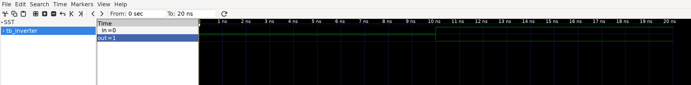
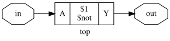
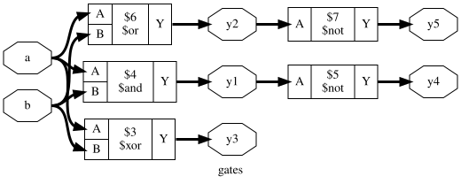
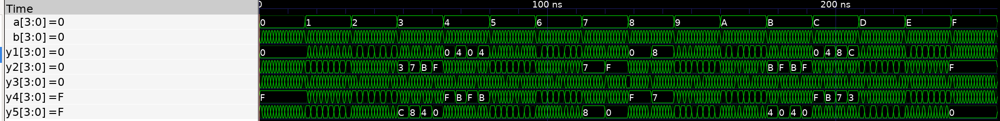

# Chapter 04 : Hardware description languages

Universities and is almost split evenly on `SystemVerilog` or `VHDL`. 
Industry is more leading toward SystemVerilog, which is less verbose and 
cumbersome than VHDL.

Once I know one of them the other will be easy to learn. I choose 
`SystemVerilog` for this courses.

Purposes of HDLs are logic **simulation** and **synthesis**. 
Simulation is required to verify a module work properly. During synthesis a 
textual description of a module is transformed into logic gates.

Design files for inverter implementation in SystemVerilog can be found in 
`projects/ch04/*inverter*`.

Here's the result of a simulation pass, whith input simulated using a testbench 
module.

Here's the inverter schematic generated by the current workflow.

Here's a more complexe *gates* circuit, testing a lot of gates on 4 pins signals.

