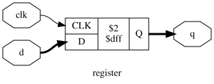
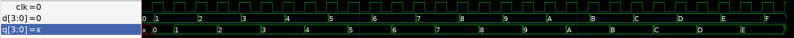
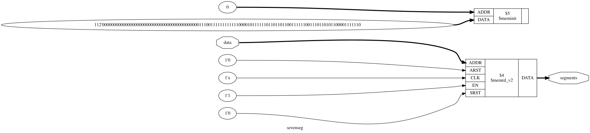
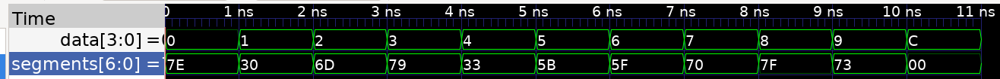

# Chapter 04 : Hardware description languages

Universities and is almost split evenly on `SystemVerilog` or `VHDL`. 
Industry is more leading toward SystemVerilog, which is less verbose and 
cumbersome than VHDL.

Once I know one of them the other will be easy to learn. I choose 
`SystemVerilog` for this courses.

Purposes of HDLs are logic **simulation** and **synthesis**. 
Simulation is required to verify a module work properly. During synthesis a 
textual description of a module is transformed into logic gates.

Design files for inverter implementation in SystemVerilog can be found in 
`projects/ch04/*inverter*`.

Here's the result of a simulation pass, whith input simulated using a testbench 
module.

Here's the inverter schematic generated by the current workflow.

Here's a more complexe *gates* circuit, testing a lot of gates on 4 pins signals.

Some syntax shenaningan:
- `{}` is used to concatenate signal (`3{b[0]}` mean `b[0]` signal repeated 3 times, or 
`{b[0], c[0], 3'b101'}` is a concatenation of 2 vars with a 101 constant.)
- `1'bz'` is use to indicate 1 floating bit.
- `#1` mean "wait one unit of time, whose defined at the top of file. Delays can be inserted 
in *statements* or in *expression*.
- `&a` can be used to say "a AND of all pins contained in a", so if a is `logic [7:0] a` 
it will be a AND of the 8 `a` pins.
- support of ternary condition: `condition ? true : false`, used to build mux/demux.
- `modules` are kind-of function, reusable block with defined inputs and outputs.
- A top module is needed for a real design.

## Sequential circuit

- `always_ff` is used to describe recurring event that happen **on flip-flop 
only**, similarly `always_latch`, `always_comb`. If a recurring event occure 
on signal that affect other things, an error will at compilation.
- `<=` is used as a *nonblocking assignment* in `always` blocks. It replace 
`assign`. `=` is used for *blocking assignment*, exclusively in `always` 
statements.
- `always_comb` *tells the simulator how to execute the behavioral description, 
while telling synthesis tools that the description is intended to represent a 
combinational function*. So, for the synthesis it's not much different from 
outside always_comb, however always_comb enable **procedural syntax**: `if`, 
`case`, so it's often more clear *for complex combinational block*.

Sevenseg circuit is an example of case() syntax.

