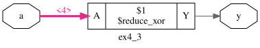
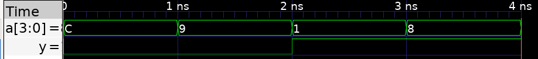
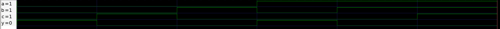
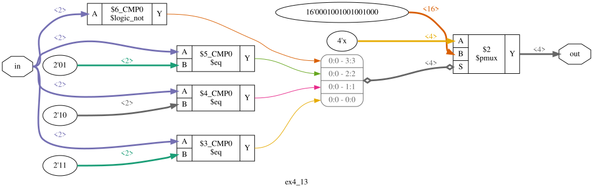
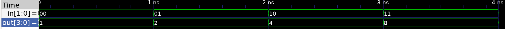
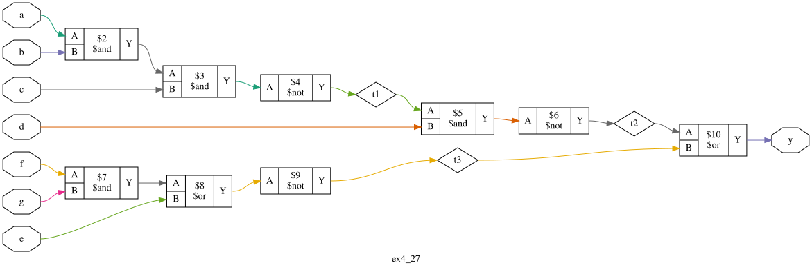
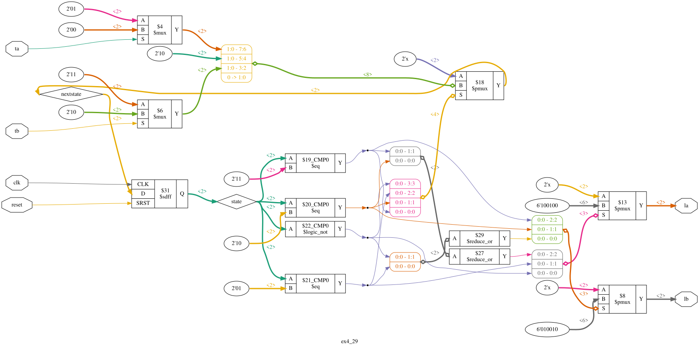
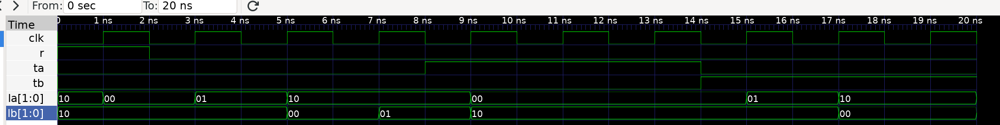

# Chapter 04 : exercices

## 4.3

## 4.9

- Y = Ab + bc + aBC

| A | B | C | Y |
|---|---|---|---|
| 0 | 0 | 0 | 1 |
| 0 | 0 | 1 | 0 |
| 0 | 1 | 0 | 0 |
| 0 | 1 | 1 | 1 |
| 1 | 0 | 0 | 1 |
| 1 | 0 | 1 | 1 |
| 1 | 1 | 0 | 0 |
| 1 | 1 | 1 | 0 |

## 4.13

| A | B | Y0 | Y1 | Y2 | Y3 |
|---|---|----|----|----|----|
| 0 | 0 | 1  | 0  | 0  | 0  |
| 0 | 1 | 0  | 1  | 0  | 0  |
| 1 | 0 | 0  | 0  | 1  | 0  |
| 1 | 1 | 0  | 0  | 0  | 1  |

## 4.17

Note that the toolchain did some optimization to the block (removing not gates, ...).

## 4.29

## 4.43
## 4.47
