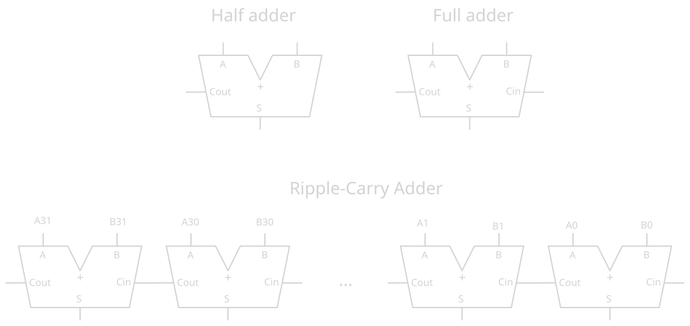
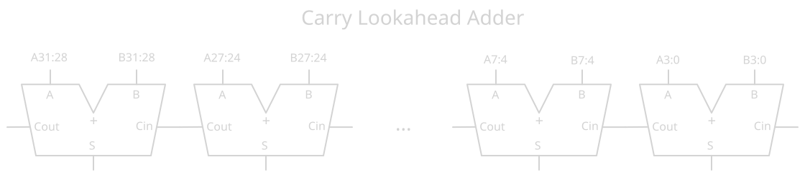
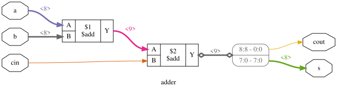
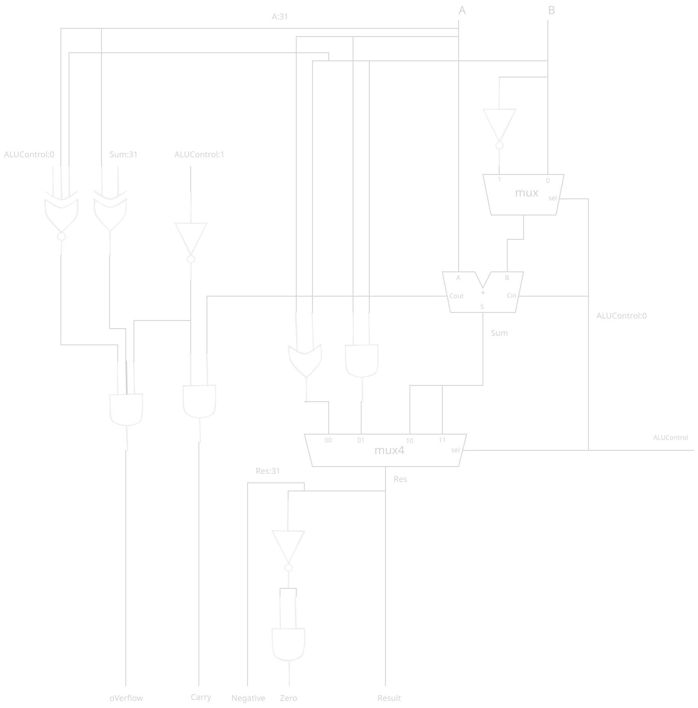
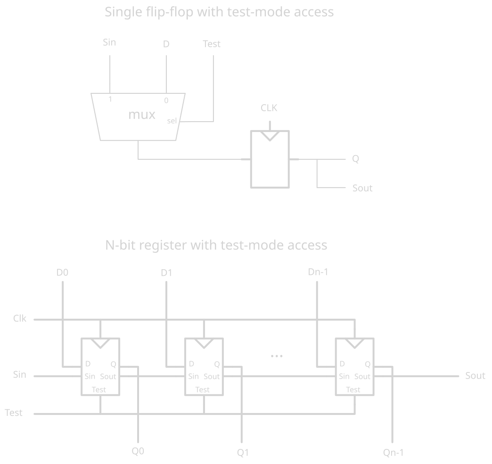
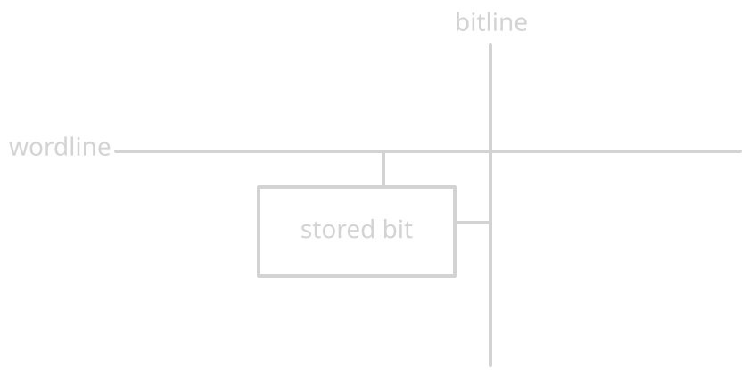
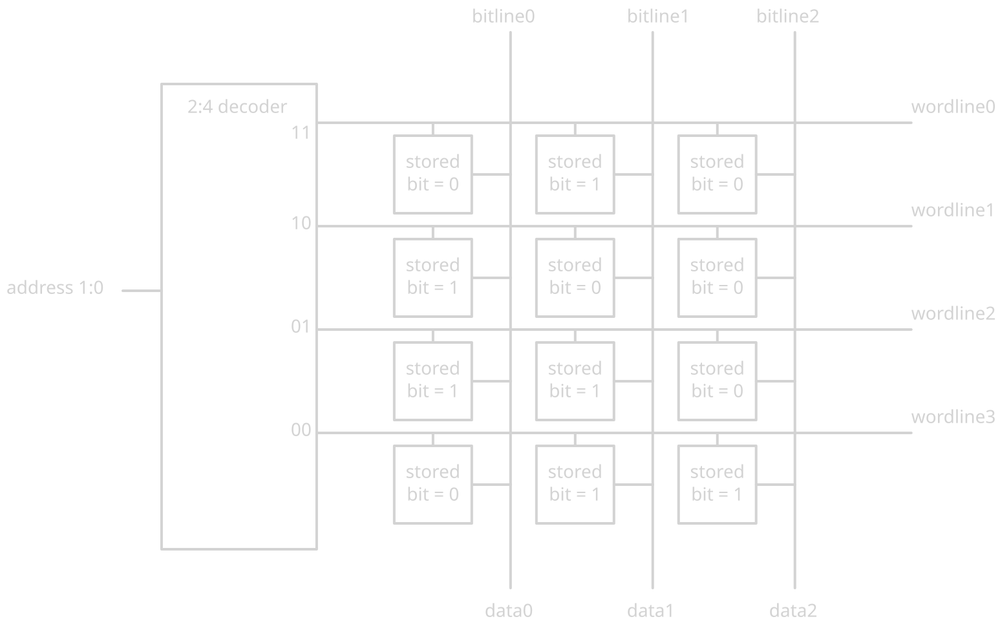
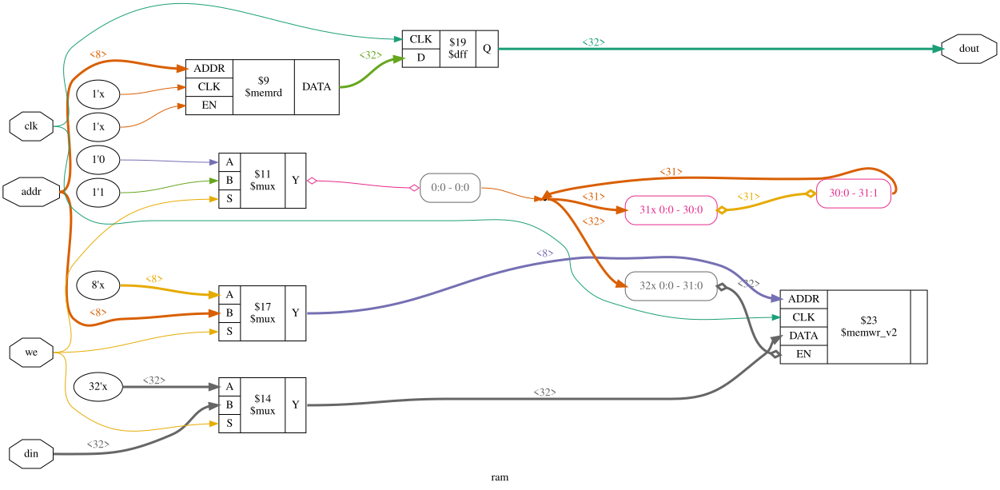
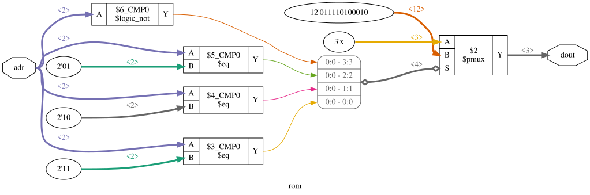

# Chapter 5 : Digital building blocks

This chapter introduce more elaborate combination and sequential building 
blocks used in digital systems. Theses block include arithmetic circuits, 
counters, shift registers, memory arrays, logic arrays.

Theses building block demonstrate the the principles of hierarchy, modularity 
and regularity. They are assembled from simpler components such as logic gates, 
multiplexer and decoders. Each of them have a well defined interface and can be 
treated as a black box.

## Arithmetic circuits

A **half-adder** lacks a Carry-in signal. The **full-adder** have it.
By putting full-adder togeteh we build **Carry Propagate Adder**.

The simple implementation is **Ripple-Carry Adder**, where all full adders are 
put in series, this work, but it's slow, because the carry have to go through 
all the chain in serie, so the delay grows directly with the number of bits.

**Carry Lookahead Adder** is a more clever way. It split the computation into 
4 bits blocks. CLAs isn't a different way of computing the sum, it's a 
different way of computing the carry. It replace the slow serial carry 
computation with a parallel boolean network.

A and B signal are transformed into P (propagate) and G (generate) signal :
- P = A ^ B
- G = AB

This can be used then to calculate the carry C4 out of the block, without 
having to got through all full adder (C0 is the input carry signal of the 
block):
- C4 = G3 + P3G3 + P3P2G1 + P3P2P1G0 + P3P2P1P0C0

The output Si is defined as :
- Si = Pi ^ Ci

For a number of bits N > 16 a Carry-Lookahead Adder is much more efficient than 
a Ripple-Carry Adder.

The **prefix adder** extend the CLA concept by combining propagate/generation 
into a tree. It can use different tree structure to tradoff fanout, delay, 
routing and gate counts. It's much efficient and reduce the time complexity 
to O(log2N) instead of O(N) for ripple-carry and CLA.

HDLs provide the `+` operation to specify a Carry-Propagate Adder. Modern 
synthesis tools select among possible implementation coosing the smallest 
design that meet the speed requirements.

Here's a synthetized adder shcematics:

Substraction reuse the adder logic. To compute A - B we only have to invert B 
and add it to A. To invert B we need to flip all B bits and add 1 (adding 1
can be done with Cin=1).

Comparison: equality is dead simple: check all bit with a XNOR gate. Magnitude 
comparison (`>=, ...`) is done with substraction and checking the sign of the 
result.

### Arithmetic and Logical Unit (ALU)

Putting things together, an ALU is a circuit that allow to select between 
differents operations on its input, depending on some control bits.

| ALUcontrol | Operation |
|------------|-----------|
|     00     |    add    |
|     01     |    sub    |
|     10     |    and    |
|     11     |    or     |

Comparison and magnitude comparison can be observed by looking at the flags 
after a substraction operation.

Shifters and rotators move bits, so multiply/divide by power of 2. There is 
logical shifter, artihmetic shifter (same as logical shifter except that 
shift right fill the MSB bits by previous MSB bits), rotators.

Multipliers and dividors can have multiple implementation with different trade/
cost, synthesis tool may pick the most apropriate. *Multiply accumulate* 
operation multiply 2 number and add it to a 3rd. This is often used in signal 
processing.

Computer arithmetic is a complex subjects, some books are dedicated to it :
- *Digital Arithmetic* - Ercegovaz, Lang
- *CMOS VLSI Design* - Weste, Harris

**Fixed and floating point numbers** are ways to represent rational numbers. 
Fixed works a bit like unsigned integer, except that there is an integer part, 
and a decimal part, both fixed.

Floating point numbers are a bit more complicated. They are composed of :
- a sign
- a mantissa (M)
- an exponent (E)

A floating point number is equal to `sign * M * 2 power E`. There is some 
exception: 0, inf, NaN.

## Sequential building blocks

A **counter** is a N bit binary number that increment at every clock cycle. It 
have a reset input. One can use the most significant bit to produce a *digitaly 
controled oscillator*. Say the counter is incremented by `p` at a frequency of 
`Fclk`, the most significant bit of the counter will toggle at 
`Fout = Fclk * p/(2 pow N)`. We can produce any frequency with this. A larger 
N gives more precise control at the cost of more hardware. See `project/blinky` 
for an example of counter usage to divide a frequency.

A **shift register** shift input in time. It have an input Sin, an output Sout, 
N parallel outputs Q, and a clock. On each rising edge of the clock a new bit 
is shifted from Sin and all subsequent content are shifted forward, up to Sout. 
Shift register act like a *serial-to-parallel converters*. Shift register can 
be modified to take parallel input and a control signal Load. It's inverse, a 
*parallel-to-serial converter* exist.

**scan chain** is a technic that help testing sequential circuits. We modify 
the flip-flops to allow a *test mode*. In this *test mode* the flip flop act 
like a shift register, without the test mode it still act like a regular flip 
flop.

This technics allow writing any bit in the register during the tests, allowing 
tests that would be otherwise complicates (ex: wait for a counter to reach MSB 
bits).

### Memory arrays

Registers built from flip-flop are memory that store small amount of data, for 
much data we need **memory array** such as *DRAM*, *SRAM* and *ROM*. Memory 
arrays are arays of *bit cells*.

When the wordline is high the stored bit transfert to (or from) the bit line. 
Bitline are tristate lines: if they are floating then it's a read operation and 
the bitline will be drived by the bit cell, otherwise it's a write operation 
and the bit cell will be set by the value of the bitline. Memory array are 
accessed with an address parameter, which are send to a decoder to assert the 
corresponding wordline.

This circuit show a 4*3 memory array, with 2-bit-wise address and 3-bit wide 
words.

All memory array can have one or more *ports*. Multiproted memory can access 
several address simultaneously. For example a 3 ported memory could have :
- Read address A1 and put result in RD1.
- Read address A2 and put result in RD2.
- Read address A3 and write RD3 data if WEN3 assert.

Memory array are specified by their size (depth * width) and the number and 
type of ports. All memory array use bit cells, but they differe in how they 
store bits.

**RAM and ROM** are very misnamed. A RAM is a volatile memory, a ROM is a 
non-volatile memory, that's all. *Dynamic RAM* store data with capacitors, 
*static RAM* store data with a pair of cross coupled inverter. There are 
many flavors of ROM.

DRAM read destroy the bit, and must restore it. Also, the content must be 
refreshed (read and rewrite) every miliseconds. To overcome theses issue 
some technology has been developped: **Synchronous DRAM: SDRAM** use a clock to 
pipeline memory access. **Double Data Rate DRAM** use both the falling edge and 
the rising to access data, thus doubling the throughput for a given clock 
speed. Later standard *DDR2*, *DDR3*, *DDR4* increase the clock speeds.

Although SRAM use crossed inverter for storing bit data, the latency is far 
better on flip-flop. Because memory access on SRAM (as on DRAM) involve also 
address decoding, column multiplexing, ...

| MemType  | TransistorPerBitCell | Latency |
|----------|----------------------|---------|
| flipflop |          20          | Fast    |
| SRAM     |           6          | Medium  |
| DRAM     |           1(cap)     | Low     |

A group of (flip-flop based) registers is called a *register file*. It can 
be built as a small multiported SRAM array, because it's more compact.

ROMs can be build using logic gates and/or transistor, the data inside are 
then defined by the gates used to construct the ROM. *fuse-programable ROM* is 
used for one-time programmable ROM (a fuse is blown up to set a bit at 1, this 
action is irreversible). *Erasable Programable ROM (EPROM)* replace the fuse 
with a floating gate transistor, that can be triggered using high voltage 
near or with UV light. *Electrical EPROM* and *Flash* memory use similar 
principle but include circuitry on the chip for erasing and programing. EEPROM 
bit cells are individualy erasable, Flash erase large block of memory and so is 
cheaper than EEPROM.

Even if they are primary used to data storage, memory array can be used to 
perform logic. Such things are called *Lookup Tables (LUTs)*.

RAM synthetized schematic:

NOTE that we should take to use idiomatic pattern to make synthesis use the 
available hardware (BRAM blocks). The original book implementation use an 
asynchronous read, that may prevent the synthesis to use BRAM block.

ROM synthetized schematic:

