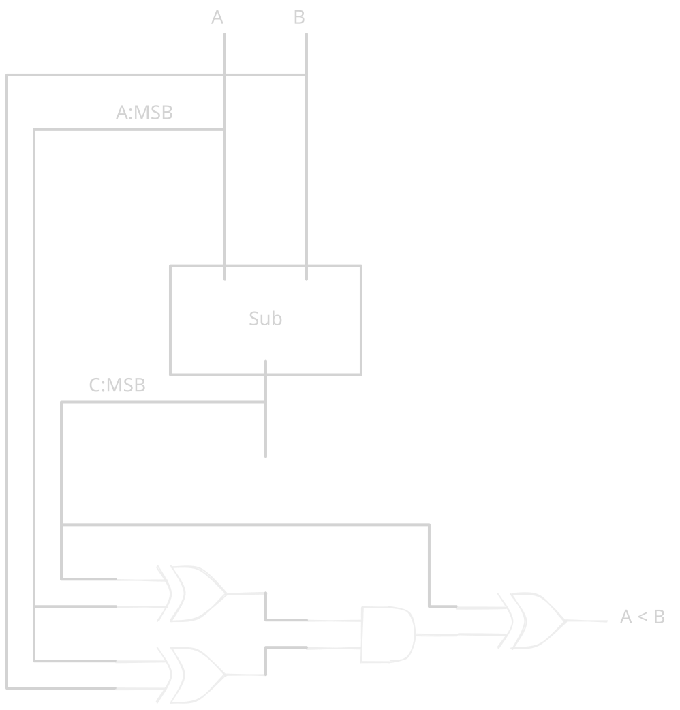

# Chapter 05 exercices

## 5.1
a)
- T = 64 * 450
- T = 28800

b)
- T = 150 + 6 * 150 + (64/4 - 1) * (150 * 2) + (4 * 450)
- T = 7350

c)
- T = 150 + (log2(64) * 300) + 150
- T = 2100

## 5.3

I'd say that for N < 16 bit it's not worth it.

Carry-lookahead cost more gates than ripple-carry adder, so if chip area is the 
critical resources a designer might make this choice.

## 5.9

a) two 4-bit signed numbers A and B for which a 4-bit signed comparator compute 
A < B.

- A = 1
- B = 2

b) two 4-bit signed numbers A and B for which a 4-bit signed comparator compute 
A > B.

- A = -6
- B = 6

c) In general, when does the N-bit signed comparator operate incorrectly ?

In case of overflow.

## 5.10

## 5.11

WARNING: test bench for it is ex15

## 5.15
## 5.21
## 5.47
## 5.53
## 5.63
Do it for GOWIN FPGA (not cyclone)
