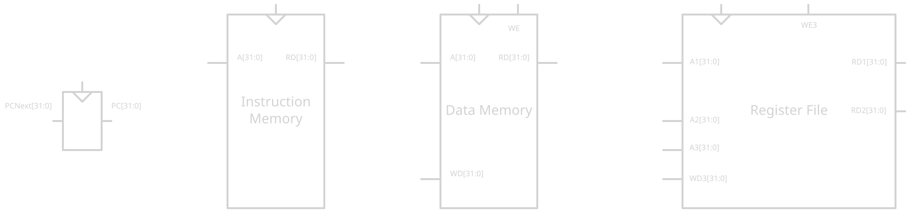

# Chapter 07 : Micro-Architecture

This chapter focus of putting pieces together and construct a RISCV pure-RV32I 
processor, we're gonna build **3 versions** of different trade-off between 
performance, costs and complexity. RISCV RV32I can have many architecture 
but each of them respecting higher-level RISCV architecture.

The *architectural state* is fairly simple :
- PC: 32 bits register
- register fold (32 * 32bit register)

