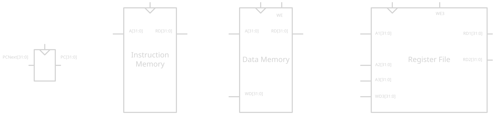

# Chapter 07 : Micro-Architecture

This chapter focus of putting pieces together and construct a RISCV pure-RV32I 
processor, we're gonna build **3 versions** of different trade-off between 
performance, costs and complexity. RISCV RV32I can have many architecture 
but each of them respecting higher-level RISCV architecture.

The *architectural state* is fairly simple :
- PC: 32 bits register
- register fold (32 * 32bit register)

**single-cycle** microarchitecture execute an entire instruction in one cycle. 
It's simple, but the cycle time is limited by the slowest instruction. And this 
micro-architecture require that data memory is separated from instruction 
memory which is not possible in general.

The **multicycle microarchitecture** execute only one instruction at a time, 
but may use multiple clock-cycle for each instruction. This allow for 
decomposing instructions compute and so reuse hardware blocks (a adder can 
be reused multiple time for a single instruction compute), reducing hardware 
cost. This also allow data and and instruction memory in the same place, using 
one clock cycle for fetch instruction, and one clock to write the data. Because 
they use less hardware, it was the prefered microarchitecture.

The **pipelined microarchitecture** apply pipelining to the single-cycle 
microarchitecture. It can execute several instructions simulteanously, 
improving performance. We must add logic to handle dependencies between 
simultenaously executing instruction, it also require non-architectural 
pipeline register. Pipelined processor must access instruction and data 
in the same cycle, they use separate instruction and data cache for this 
purpose. The added logic, register and design are worthwhile, all commercial 
processor use pipelined microarchitecture today.

### Single-cycle processor

In the case of `lw`, the instruction and register are fetch from storage at the 
start of the cycle, the combinational logic occure before the next cycle, and 
the effective write in register (the load) is done at the start of the next 
cycle.

There is a block `Extend` whose role is to convert the immediates into a signed 
32 bit value. It have a control value to decide how to interpret it's input 
(it take the whole [31:7] range as input).

| ImmSrc | Use                                           |
|--------|-----------------------------------------------|
|   00   | Immediate encoding of instruction type I.     |
|   01   | Immediate encoding of instruction type S.     |
|   10   | Immediate encoding of instruction type B.     |
|   11   | Immediate encoding of instruction type J.     |

We can divide te control unit into 2 parts: *main decoder* and *ALU decoder*.
Main decoder produce ALUOp, which is used by ALU decoder (along with 
func3[2:0], func7[5] and op[5]) to produce ALUControl.

Here's the truth table of the main decoder for `lw`, `sw`, R-type, `beq`,
I-type, `jal`:
|   Op    | RegWrite | ImmSrc | ALUSrc | MemWrite | ResSrc | Branch | ALUOp | jump |
|---------|----------|--------|--------|----------|--------|--------|-------|------|
| 0000011 |    1     |   00   |   1    |    0     |   01   |   0    |  00   |  0   |
| 0100011 |    0     |   01   |   1    |    1     |   xx   |   0    |  00   |  0   |
| 0110011 |    1     |   xx   |   0    |    0     |   00   |   0    |  10   |  0   |
| 1100011 |    0     |   10   |   0    |    0     |   xx   |   1    |  01   |  0   |
| 0010011 |    1     |   00   |   1    |    0     |   00   |   0    |  10   |  0   |
| 1101111 |    1     |   11   |   x    |    0     |   10   |   0    |  10   |  1   |

Here's the ALU decoder truth table:
| ALUOp | funct3 | {op[5], func7[5]} | ALUControl | Instruction |
|-------|--------|-------------------|------------|-------------|
|  00   |  xxx   |        xx         |    000     |   lw, sw    |
|  01   |  xxx   |        xx         |    001     |     beq     |
|  10   |  000   |   00 | 01 | 10    |    000     |     add     |
|  10   |  000   |        11         |    001     |     sub     |
|  10   |  010   |        xx         |    101     |     slt     |
|  10   |  110   |        xx         |    011     |     or      |
|  10   |  111   |        xx         |    010     |     and     |
